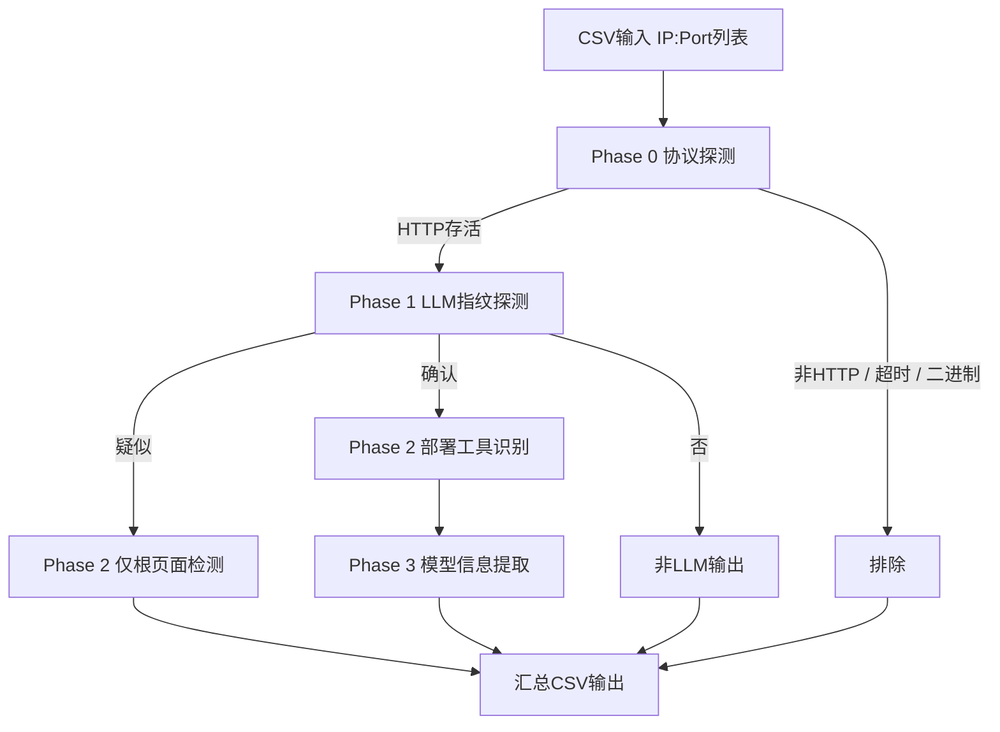

# LLM 扫描策略指纹速查表

> 规则来源：`llm_scan_rules.yaml` (version 1)  
> 引擎实现：`scan_config.py` · `scan_llm.py`

---

## 整体流程




---

## 运行参数


| 阶段      | 并发数 | 超时（秒） | 重试次数   | 特殊参数                |
| ------- | --- | ----- | ------ | ------------------- |
| Phase 0 | 500 | 3     | 1（仅超时） | —                   |
| Phase 1 | 300 | 5     | 0      | —                   |
| Phase 2 | 200 | 5     | 0      | `max_extra_gets: 3` |
| Phase 3 | 100 | 10    | 1      | —                   |


---

## Phase 0 — 协议探测与非 HTTP 排除

**探测方式：** 先 `GET http://ip:port/`，失败则 `GET https://ip:port/`（忽略证书）

### 非 HTTP 字节前缀指纹

检测原始响应字节（raw bytes）的前缀，匹配则立即排除。


| 前缀字节（UTF-8 / 十六进制）   | 识别协议                    | 动作  |
| -------------------- | ----------------------- | --- |
| `-ERR`               | Redis 错误回复              | 排除  |
| `+OK`                | Redis 内联 OK             | 排除  |
| `+PONG`              | Redis PING 响应           | 排除  |
| `SSH-2.0`            | SSH-2 协议握手              | 排除  |
| `* OK`               | IMAP 欢迎行                | 排除  |
| `* BYE`              | IMAP 告别行                | 排除  |
| `220 `               | SMTP / FTP 就绪（含末尾空格）    | 排除  |
| `RFB `               | VNC RFB 协议握手            | 排除  |
| `\xff\xfd`           | Telnet IAC DO 协商        | 排除  |
| `\x4a\x00\x00\x00`  | MySQL 初始握手（包头长度 J + NUL） | 排除  |
| `N\x00\x00\x00`      | PostgreSQL 启动消息长度前缀     | 排除  |


### 二进制响应指纹


| 检测规则                                             | 动作               |
| ------------------------------------------------ | ---------------- |
| 前 512 字节中不可打印字符占比 > **30%**（且非 `HTTP/` 开头的合法 HTTP 响应） | 排除（数据库或自定义二进制协议） |

> **注：** 如果原始响应以 `HTTP/` 开头（包括 HTTP/1.0、HTTP/1.1），跳过二进制检测，避免将 gzip 编码的 HTTP 响应误排除。


### Phase 0 输出


| `protocol` 值 | 含义                  |
| ------------ | ------------------- |
| `http`       | HTTP 存活，进入 Phase 1  |
| `https`      | HTTPS 存活，进入 Phase 1 |
| `""` （空）     | 排除，不进入后续阶段          |


---

## Phase 1 — LLM 指纹探测

**探测方式：** 按优先级顺序逐一 `GET` 各路径，一旦命中「确认」规则立即停止。  
`/` 的响应直接复用 Phase 0 缓存，不重复请求。

### 探测路径（优先级从高到低）


| 优先级 | 路径                  | 有确认规则 | 说明                                    |
| --- | ------------------- | ----- | ------------------------------------- |
| 1   | `/v1/models`        | 是     | OpenAI 兼容 API（标准路径）                   |
| 2   | `/api/v1/models`    | 是     | 反向代理前缀变体，别名为 `/v1/models`             |
| 3   | `/openai/v1/models` | 是     | 另一种常见代理前缀，别名为 `/v1/models`            |
| 4   | `/api/tags`         | 是     | Ollama                                |
| 5   | `/api/version`      | 是     | Ollama 版本（受 guard 限制）                 |
| 6   | `/info`             | 是     | TGI                                   |
| 7   | `/health`           | **否** | 仅探测并缓存，不触发确认                          |
| 8   | `/docs`             | 是     | Swagger / OpenAPI 文档                  |
| 9   | `/v2/models`        | 是     | Triton / KServe v2 推理 API             |
| 10  | `/`                 | —     | 疑似检测专用（复用 Phase 0 缓存）                 |


### 确认规则（→ `is_llm = "确认"`）


| 路径                  | 要求状态码 | 匹配类型                 | 匹配条件                                                                         | 别名写入（`cache_also_as`） |
| ------------------- | ----- | -------------------- | ---------------------------------------------------------------------------- | -------------------- |
| `/v1/models`        | 200   | `json_all`           | `JSON["object"] == "list"` **AND** `JSON["data"]` 存在                         | —                    |
| `/api/v1/models`    | 200   | `json_all`           | 同上                                                                           | `/v1/models`         |
| `/openai/v1/models` | 200   | `json_all`           | 同上                                                                           | `/v1/models`         |
| `/api/tags`         | 200   | `json_has_key`       | `JSON` 顶层含 `"models"` 键                                                      | —                    |
| `/api/version`      | 200   | `json_has_key`       | `JSON` 顶层含 `"version"` 键                                                     | —                    |
| `/info`             | 200   | `json_has_key`       | `JSON` 顶层含 `"model_id"` 键                                                    | —                    |
| `/v2/models`        | 200   | `json_has_key`       | `JSON` 顶层含 `"models"` 键                                                      | —                    |
| `/docs`             | 任意    | `body_substring_any` | body 含 `/v1/chat/completions` **OR** `/v1/embeddings` **OR** `/api/generate` | —                    |

> **`cache_also_as`：** 当代理前缀变体路径（如 `/api/v1/models`）命中确认规则时，响应同时写入别名路径（`/v1/models`）的缓存，确保 Phase 2 中依赖 `/v1/models` 的工具正常工作。


### 疑似规则（→ `is_llm = "疑似"`）

在所有 API 路径均未确认后，检查 `GET /` 的响应 body（大小写不敏感）：


| 条件类型              | 规则                                                 |
| ----------------- | -------------------------------------------------- |
| 关键词（任一出现）         | `gradio`                                           |
| 关键词（任一出现）         | `streamlit`                                        |
| 关键词（任一出现）         | `open-webui`                                       |
| 关键词（任一出现）         | `__gradio_mode__`                                  |
| 关键词（任一出现）         | `_stcore`                                          |
| 复合条件（全部出现 + 排除检查） | `chat` **AND** `model` 同时出现，且 body 中**不含**营销页面标志词 |

> **排除词（`exclude_if_contains`）：** `"copyright"`、`"terms of service"`、`"privacy policy"`。出现任一则该复合条件不成立，避免营销类主页误报。


### 认证阻断疑似规则（`auth_suspect`）

当任意探测路径返回 **401 / 403**，且响应 body 中含以下任一关键词时，在完整探测循环结束后（无更强信号）将目标标记为 `"疑似"`：

`bearer` · `api-key` · `api_key` · `openai` · `authorization` · `llm`

> 用途：识别需要鉴权的 LLM API（如配置了 API Key 的部署），避免因 401/403 而被误判为"非 LLM"。


### 前端保护 Guard（确认 → 疑似降级）


| 触发条件：命中路径                           | 触发条件：根页面 body 含任一                                                                        | 效果            |
| ----------------------------------- | ---------------------------------------------------------------------------------------- | ------------- |
| `/api/version` **或** `/v1/models` | `open webui` / `open-webui` / `__gradio_mode__` / `gradio-app` / `_stcore` / `streamlit` | `确认` 降级为 `疑似` |

> `/v1/models` 新增到降级路径，防止挂载了前端 UI 代理（如 open-webui）的服务被误判为纯 API 端点。


---

## Phase 2 — 部署工具识别

**评估规则：** 按工具列表顺序评估，第一个匹配成功立即返回。  
**`疑似` 目标**：只执行 `source: root`（根页面缓存读取）的工具，不发起新请求。

### 工具规则完整列表

#### 优先级 1 — open-webui（根页面，确认+疑似）


| 字段                   | 值                                           |
| -------------------- | ------------------------------------------- |
| `name`               | `open-webui`                                |
| `scope`              | `confirmed`, `suspect`                      |
| `requires_cached_ok` | —                                           |
| 探测来源                 | `root`（`GET /` 缓存）                          |
| 匹配类型                 | `body_substring_any_ci`                     |
| 匹配条件                 | body 含 `"open webui"` **OR** `"open-webui"` |
| `supplements`        | —                                           |
| `version_from`       | —                                           |


#### 优先级 2 — one-api（根页面，确认+疑似）


| 字段                   | 值                                       |
| -------------------- | --------------------------------------- |
| `name`               | `one-api`                               |
| `scope`              | `confirmed`, `suspect`                  |
| `requires_cached_ok` | —                                       |
| 探测来源                 | `root`（`GET /` 缓存）                      |
| 匹配类型                 | `body_substring_any_ci`                 |
| 匹配条件                 | body 含 `"One API"` **OR** `"New API"` |
| `supplements`        | —                                       |
| `version_from`       | —                                       |


#### 优先级 3 — ollama（API，仅确认）


| 字段                   | 值                                                |
| -------------------- | ------------------------------------------------ |
| `name`               | `ollama`                                         |
| `scope`              | `confirmed`                                      |
| `requires_cached_ok` | —                                                |
| 探测来源（主）              | `cached:/api/tags`（不发新请求）                        |
| 匹配类型（主）              | `json_has_key`                                   |
| 匹配条件（主）              | `JSON` 顶层含 `"models"` 键                          |
| 补充探测                 | `get:/api/tags` → `JSON` 顶层含 `"models"` 键（主失败时）  |
| `version_from`       | `cached_or_get:/api/version` → `JSON["version"]` |

> **新增补充探测：** 当 Phase 1 经由 `/v1/models` 确认（未缓存 `/api/tags`）时，通过补充 GET 请求探测 `/api/tags` 识别 Ollama。`version_from` 在主匹配和补充匹配成功后均会执行。


#### 优先级 4 — tgi（API，仅确认）


| 字段                   | 值                                                    |
| -------------------- | ---------------------------------------------------- |
| `name`               | `tgi`                                                |
| `scope`              | `confirmed`                                          |
| `requires_cached_ok` | —                                                    |
| 探测来源                 | `cached:/info`（不发新请求）                                |
| 匹配类型                 | `json_all_keys_exist`                                |
| 匹配条件                 | `JSON` 同时含 `"model_id"` **AND** `"max_input_length"` |
| `supplements`        | —                                                    |
| `version_from`       | —                                                    |


#### 优先级 5 — vllm（API，仅确认）


| 字段                   | 值                                                |
| -------------------- | ------------------------------------------------ |
| `name`               | `vllm`                                           |
| `scope`              | `confirmed`                                      |
| `requires_cached_ok` | —                                                |
| 探测来源（主）              | `cached:/v1/models`                              |
| 匹配类型（主）              | `json_nested_contains_ci`                        |
| 匹配条件（主）              | `JSON["data"][0]["owned_by"]` 含 `"vllm"`（大小写不敏感） |
| 补充探测                 | `get:/metrics` → body 含 `"vllm_"`（区分大小写）         |
| `version_from`       | —                                                |


#### 优先级 6 — llama.cpp（API，仅确认，需前置条件）


| 字段                   | 值                                      |
| -------------------- | -------------------------------------- |
| `name`               | `llama.cpp`                            |
| `scope`              | `confirmed`                            |
| `requires_cached_ok` | `/v1/models`（缓存状态码须为 200）              |
| 探测来源                 | `get:/props`（总是发新请求）                   |
| 匹配类型                 | `body_substring`                       |
| 匹配条件                 | body 含 `"default_generation_settings"` |
| `supplements`        | —                                      |
| `version_from`       | —                                      |


#### 优先级 7 — sglang（API，仅确认，需前置条件）


| 字段                   | 值                           |
| -------------------- | --------------------------- |
| `name`               | `sglang`                    |
| `scope`              | `confirmed`                 |
| `requires_cached_ok` | `/v1/models`                |
| 探测来源                 | `get:/get_server_info`      |
| 匹配类型                 | `body_substring_ci`         |
| 匹配条件                 | body 含 `"sglang"`（大小写不敏感）  |
| `supplements`        | —                           |
| `version_from`       | —                           |


#### 优先级 8 — litellm（API，仅确认，需前置条件）


| 字段                   | 值                                   |
| -------------------- | ----------------------------------- |
| `name`               | `litellm`                           |
| `scope`              | `confirmed`                         |
| `requires_cached_ok` | `/v1/models`                        |
| 探测来源                 | `get:/model/info`                   |
| 匹配类型                 | `body_substring_ci`                 |
| 匹配条件                 | body 含 `"litellm_params"`（大小写不敏感） |
| `supplements`        | —                                   |
| `version_from`       | —                                   |


#### 优先级 9 — fastchat（API，仅确认，需前置条件）


| 字段                   | 值                           |
| -------------------- | --------------------------- |
| `name`               | `fastchat`                  |
| `scope`              | `confirmed`                 |
| `requires_cached_ok` | `/v1/models`                |
| 探测来源                 | `cached_or_get:/docs`       |
| 匹配类型                 | `body_substring_ci`         |
| 匹配条件                 | body 含 `"fastchat"`（大小写不敏感） |
| `supplements`        | —                           |
| `version_from`       | —                           |


#### 优先级 10 — xinference（API，仅确认，需前置条件）


| 字段                   | 值                             |
| -------------------- | ----------------------------- |
| `name`               | `xinference`                  |
| `scope`              | `confirmed`                   |
| `requires_cached_ok` | `/v1/models`                  |
| 探测来源                 | `cached_or_get:/docs`         |
| 匹配类型                 | `body_substring_ci`           |
| 匹配条件                 | body 含 `"xinference"`（大小写不敏感） |
| `supplements`        | —                             |
| `version_from`       | —                             |


#### 优先级 11 — localai（API，仅确认，需前置条件）


| 字段                   | 值                                              |
| -------------------- | ---------------------------------------------- |
| `name`               | `localai`                                      |
| `scope`              | `confirmed`                                    |
| `requires_cached_ok` | `/v1/models`                                   |
| 探测来源                 | `cached_or_get:/docs`                          |
| 匹配类型                 | `body_substring_any_ci`                        |
| 匹配条件                 | body 含 `"localai"` **OR** `"models/available"` |
| `supplements`        | —                                              |
| `version_from`       | —                                              |


#### 优先级 12 — 未知-OpenAI兼容（兜底，仅确认，需前置条件）


| 字段                   | 值                            |
| -------------------- | ---------------------------- |
| `name`               | `未知-OpenAI兼容`                |
| `scope`              | `confirmed`                  |
| `requires_cached_ok` | `/v1/models`                 |
| 匹配类型                 | `always`（无条件匹配）              |
| 说明                   | `/v1/models` 已确认但以上工具均未识别时命中 |


#### 优先级 13 — triton（v2 推理 API，仅确认）


| 字段                   | 值                                |
| -------------------- | -------------------------------- |
| `name`               | `triton`                         |
| `scope`              | `confirmed`                      |
| `requires_cached_ok` | —                                |
| 探测来源                 | `cached:/v2/models`（不发新请求）       |
| 匹配类型                 | `json_has_key`                   |
| 匹配条件                 | `JSON` 顶层含 `"models"` 键          |
| 说明                   | 依赖 Phase 1 经由 `/v2/models` 路径缓存 |


#### 优先级 14 — langserve（API，仅确认）


| 字段                   | 值                                                                |
| -------------------- | ---------------------------------------------------------------- |
| `name`               | `langserve`                                                      |
| `scope`              | `confirmed`                                                      |
| `requires_cached_ok` | —                                                                |
| 探测来源                 | `cached_or_get:/docs`                                            |
| 匹配类型                 | `body_any_of`（OR）                                                |
| 匹配条件                 | body 含 `"langserve"` **OR** （body 同时含 `"invoke"` AND `"stream"`） |
| `supplements`        | —                                                                |
| `version_from`       | —                                                                |


#### 优先级 15 — gradio（根页面，确认+疑似）


| 字段                   | 值                                                                  |
| -------------------- | ------------------------------------------------------------------ |
| `name`               | `gradio`                                                           |
| `scope`              | `confirmed`, `suspect`                                             |
| `requires_cached_ok` | —                                                                  |
| 探测来源                 | `root`（`GET /` 缓存）                                                 |
| 匹配类型                 | `body_substring_any_ci`                                            |
| 匹配条件                 | body 含 `"__gradio_mode__"` **OR** `"gradio-app"` **OR** `"gradio"` |
| `supplements`        | —                                                                  |
| `version_from`       | —                                                                  |


#### 优先级 16 — streamlit（根页面，确认+疑似）


| 字段                   | 值                                                               |
| -------------------- | --------------------------------------------------------------- |
| `name`               | `streamlit`                                                     |
| `scope`              | `confirmed`, `suspect`                                          |
| `requires_cached_ok` | —                                                               |
| 探测来源                 | `root`（`GET /` 缓存）                                              |
| 匹配类型                 | `body_substring_any_ci`                                         |
| 匹配条件                 | body 含 `"_stcore"` **OR** `"streamlitapp"` **OR** `"streamlit"` |
| `supplements`        | —                                                               |
| `version_from`       | —                                                               |


#### 优先级 17 — open-webui（根页面兜底，仅确认）


| 字段                   | 值                                      |
| -------------------- | -------------------------------------- |
| `name`               | `open-webui`                           |
| `scope`              | `confirmed`                            |
| `requires_cached_ok` | —                                      |
| 探测来源                 | `root`（`GET /` 缓存）                     |
| 匹配类型                 | `body_substring_ci`                    |
| 匹配条件                 | body 含 `"open-webui"`                  |
| 说明                   | 优先级 1 已处理 suspect，此条为 confirmed 的根页面兜底 |


### Phase 2 工具速查汇总


| 优先级 | 工具名          | scope  | 前置条件               | 探测路径                               | 核心匹配关键词 / 字段                                      |
| --- | ------------ | ------ | ------------------ | ---------------------------------- | ------------------------------------------------- |
| 1   | open-webui   | 确认+疑似  | —                  | `root`                             | `"open webui"` / `"open-webui"`                   |
| 2   | one-api      | 确认+疑似  | —                  | `root`                             | `"One API"` / `"New API"`                         |
| 3   | ollama       | 确认     | —                  | `/api/tags`（缓存）→ `/api/tags`（GET） | `JSON.models` 存在                                  |
| 4   | tgi          | 确认     | —                  | `/info`（缓存）                        | `model_id` + `max_input_length` 同时存在              |
| 5   | vllm         | 确认     | —                  | `/v1/models`（缓存）→ `/metrics`（GET） | `data[0].owned_by` 含 `vllm` / `"vllm_"`           |
| 6   | llama.cpp    | 确认     | `/v1/models` 缓存200 | `/props`（GET）                      | `"default_generation_settings"`                   |
| 7   | sglang       | 确认     | `/v1/models` 缓存200 | `/get_server_info`（GET）            | `"sglang"`                                        |
| 8   | litellm      | 确认     | `/v1/models` 缓存200 | `/model/info`（GET）                 | `"litellm_params"`                                |
| 9   | fastchat     | 确认     | `/v1/models` 缓存200 | `/docs`（缓存或GET）                    | `"fastchat"`                                      |
| 10  | xinference   | 确认     | `/v1/models` 缓存200 | `/docs`（缓存或GET）                    | `"xinference"`                                    |
| 11  | localai      | 确认     | `/v1/models` 缓存200 | `/docs`（缓存或GET）                    | `"localai"` / `"models/available"`                |
| 12  | 未知-OpenAI兼容  | 确认     | `/v1/models` 缓存200 | —                                  | always（无条件兜底）                                     |
| 13  | triton       | 确认     | —                  | `/v2/models`（缓存）                   | `JSON.models` 存在                                  |
| 14  | langserve    | 确认     | —                  | `/docs`（缓存或GET）                    | `"langserve"` / (`"invoke"` AND `"stream"`)       |
| 15  | gradio       | 确认+疑似  | —                  | `root`                             | `"__gradio_mode__"` / `"gradio-app"` / `"gradio"` |
| 16  | streamlit    | 确认+疑似  | —                  | `root`                             | `"_stcore"` / `"streamlitapp"` / `"streamlit"`    |
| 17  | open-webui   | 确认     | —                  | `root`                             | `"open-webui"`                                    |


---

## Phase 3 — 模型信息提取

**适用范围：** 仅 `is_llm = "确认"` 的目标。  
**执行顺序：** 缓存源按序检查 → 全无结果再发 POST 探测 → 仍无结果写 `"未知"`。

### 缓存提取源（优先级顺序）


| 优先级 | 缓存路径         | 提取类型              | 提取方式                               | 结果字段         |
| --- | ------------ | ----------------- | ---------------------------------- | ------------ |
| 1   | `/v1/models` | `json_list_field` | `JSON["data"][*]["id"]` → 逗号拼接     | `model_info` |
| 2   | `/api/tags`  | `json_list_field` | `JSON["models"][*]["name"]` → 逗号拼接 | `model_info` |
| 3   | `/info`      | `json_field`      | `JSON["model_id"]`                 | `model_info` |


### POST 探测（缓存源无结果时按序尝试）

#### POST 1 — `/v1/chat/completions`

**请求：**

```
POST /v1/chat/completions
Content-Type: application/json

{
  "model": "test",
  "messages": [{"role": "user", "content": "hi"}],
  "max_tokens": 1
}
```

**响应解析：**


| 状态码                   | 提取类型             | 提取方式                                                                                                                    |
| --------------------- | ---------------- | ----------------------------------------------------------------------------------------------------------------------- |
| `200`                 | `json_field`     | `JSON["model"]`                                                                                                         |
| `400` / `404` / `422` | `error_regex`    | **优先**：上下文精确正则 `model[":\s=]+(...)` / `model '(...)'`；**回退**：宽泛正则 `"([a-zA-Z0-9_\-./: ]+)"`，过滤：长度 3–80，含 `/` 或 `:` 或 `-` |

**排除词（`exclude_patterns`）：** `test` · `your-model-id` · `string` · `null` · `none` · `example`


#### POST 2 — `/api/generate`（Ollama 备用）

**请求：**

```
POST /api/generate
Content-Type: application/json

{
  "model": "test",
  "prompt": "hi",
  "stream": false
}
```

**响应解析：**


| 状态码                   | 提取类型          | 提取方式                     |
| --------------------- | ------------- | ------------------------ |
| `400` / `404` / `422` | `error_regex` | 同上（包含 context_patterns 和 exclude_patterns） |


### Phase 3 兜底

所有来源均无结果时，`model_info` 写入 `"未知"`。

---

## 各阶段探测路径汇总


| 路径                     | Phase 1 探测 | Phase 1 确认规则                | cache_also_as      | Phase 2 工具（来源类型）                                             | Phase 3 缓存提取     |
| ---------------------- | ---------- | --------------------------- | ------------------ | ------------------------------------------------------------ | ---------------- |
| `/`                    | 是（复用缓存）    | 无（疑似检测）                     | —                  | open-webui / one-api / gradio / streamlit（`root`）            | —                |
| `/v1/models`           | 是          | `object=list` AND `data` 存在 | —                  | vllm 主检 / llama.cpp&sglang&litellm 等前置（`cached`）             | `data[*].id`     |
| `/api/v1/models`       | 是          | 同上                          | → `/v1/models`     | 通过别名触发上行所有工具                                                 | —（别名已处理）         |
| `/openai/v1/models`    | 是          | 同上                          | → `/v1/models`     | 同上                                                           | —（别名已处理）         |
| `/api/tags`            | 是          | `models` 键存在                | —                  | ollama（`cached` 或 `get`）                                     | `models[*].name` |
| `/api/version`         | 是          | `version` 键存在               | —                  | ollama version_from（`cached_or_get`）                         | —                |
| `/info`                | 是          | `model_id` 键存在              | —                  | tgi（`cached`）                                                | `model_id`       |
| `/health`              | 是（仅缓存）     | **无**                       | —                  | —                                                            | —                |
| `/docs`                | 是          | 含 LLM 路由关键词                 | —                  | fastchat/xinference/localai/langserve（`cached_or_get`）       | —                |
| `/v2/models`           | 是          | `models` 键存在                | —                  | triton（`cached`）                                             | —                |
| `/metrics`             | 否          | —                           | —                  | vllm 补充探测（`get`）                                             | —                |
| `/props`               | 否          | —                           | —                  | llama.cpp（`get`）                                             | —                |
| `/get_server_info`     | 否          | —                           | —                  | sglang（`get`）                                                | —                |
| `/model/info`          | 否          | —                           | —                  | litellm（`get`）                                               | —                |
| `/v1/chat/completions` | 否          | —                           | —                  | —                                                            | POST 探测（模型提取）    |
| `/api/generate`        | 否          | —                           | —                  | —                                                            | POST 探测（模型提取，备用） |
