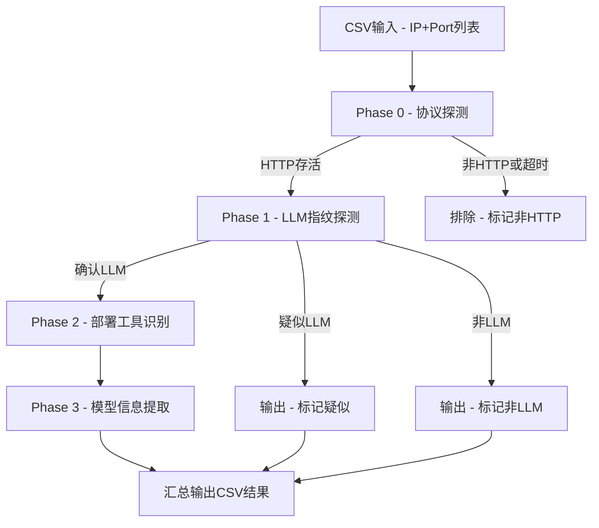
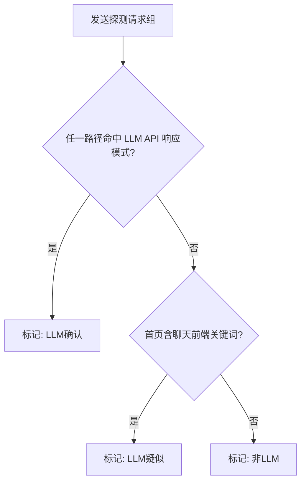
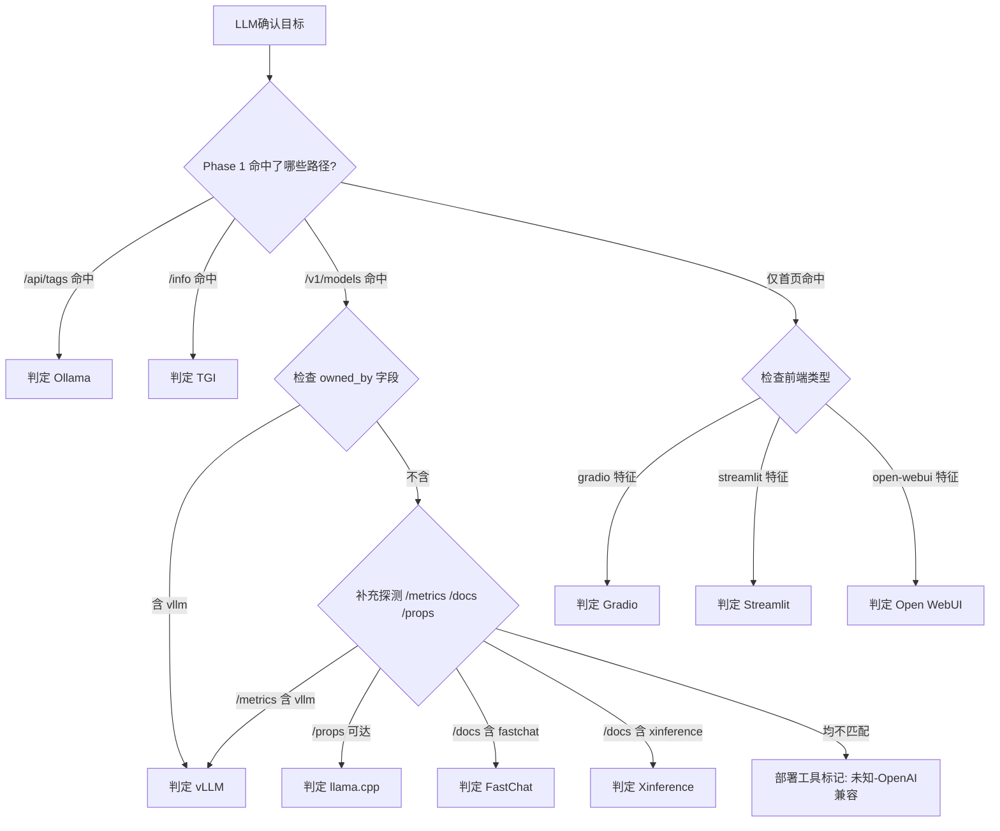

# LLM 服务端口扫描策略方案

## 文档定位

- **用途：** 作为 Python 扫描脚本的开发依据与逻辑参考
- **适用场景：** 对已知开放端口（协议未知）进行 LLM 服务识别、部署工具判断、模型信息提取
- **输入：** CSV 格式的 IP:Port 列表（端口已确认开放，协议未确认）
- **输出：** CSV 结果文档，含分层判定结果与证据摘要

---

## 整体流程



---

## Phase 0 - 协议探测

### 目的

从已知开放端口中筛选出 HTTP 或 HTTPS 可响应的目标。

### 探测逻辑

1. 对每个 IP:Port 先发送 `GET /` 至 `http://ip:port/`
2. 若 HTTP 失败（连接重置、SSL 错误等），再尝试 `https://ip:port/`（忽略证书校验）
3. 根据响应判定是否为 HTTP 服务

### 判定标准

| 结果 | 判定 |
|------|------|
| HTTP 客户端库正常解析为 Response 对象（任意状态码 1xx-5xx） | HTTP 存活，记录协议 |
| 连接超时 | 排除 |
| 连接重置且 HTTPS 也失败 | 排除 |
| 收到响应但匹配非 HTTP 指纹 | 排除 |

### 非 HTTP 排除指纹

| 响应特征 | 对应服务 |
|----------|----------|
| `-ERR` 或 `+OK` 或 `+PONG` | Redis |
| 以 `SSH-2.0` 开头 | SSH |
| 以 `* OK` 或 `* BYE` 开头 | IMAP |
| 以 `220 ` 开头 | SMTP 或 FTP |
| 纯二进制内容，非 UTF-8 可解码 | 数据库或自定义协议 |

### 参数

| 参数 | 值 |
|------|-----|
| 超时 | 3 秒 |
| 重试 | 1 次（仅超时重试） |
| 并发 | 200-500 |

### 输出

存活列表：`ip, port, protocol(http/https)`

---

## Phase 1 - LLM 快速指纹探测

### 目的

对 HTTP 存活目标判断是否为 LLM 服务。

### 探测路径（按优先级顺序）

| 优先级 | 方法 | 路径 | 期望 LLM 特征 |
|--------|------|------|----------------|
| 1 | GET | `/v1/models` | JSON 含 `data` 数组，内有 model id |
| 2 | GET | `/api/tags` | JSON 含 `models` 数组 |
| 3 | GET | `/api/version` | JSON 含版本号字符串 |
| 4 | GET | `/info` | JSON 含 `model_id` 或 `max_input_length` |
| 5 | GET | `/health` | JSON 含 `status` 且无数据库类特征 |
| 6 | GET | `/docs` | HTML 或 JSON 含 LLM 相关路由关键词 |
| 7 | GET | `/` | 首页内容含前端框架特征 |

### 判定逻辑



### LLM API 响应匹配规则

以下条件满足任一即判定为"LLM确认"：

| 路径 | 匹配条件 |
|------|----------|
| `/v1/models` | 状态码 200 且 JSON body 含 `"object"` 值为 `"list"` |
| `/api/tags` | 状态码 200 且 JSON body 含 `"models"` 键 |
| `/api/version` | 状态码 200 且 JSON body 含 `"version"` 键 |
| `/info` | 状态码 200 且 JSON body 同时含 `"model_id"` |
| `/docs` | 响应含 `/v1/chat/completions` 或 `/v1/embeddings` 或 `/api/generate` 路由文本 |

### 疑似判定关键词（首页 `/` 响应 body）

以下关键词匹配任一且无其他 API 证据时标记疑似：

- `gradio`
- `streamlit`
- `open-webui`
- `chat` 与 `model` 同时出现
- `__gradio_mode__`
- `_stcore`

### 优化策略

- 按优先级顺序探测，一旦命中"确认"条件立即停止后续路径请求
- 所有路径均未命中才发送 `GET /` 检查前端特征

---

## Phase 2 - 部署工具识别

### 目的

对 LLM 确认目标识别具体部署框架。

### 识别规则表

| 部署工具 | 判定依据 | 补充探测 |
|----------|----------|----------|
| **Ollama** | `/api/tags` 返回 200 且含 `models` 数组 | `/api/version` 获取版本 |
| **vLLM** | `/v1/models` 返回含 `"owned_by": "vllm"` | `GET /metrics` 含 `vllm_` 前缀指标 |
| **TGI** | `/info` 返回含 `model_id` + `max_input_length` + `max_batch_total_tokens` | Header 含 `x-compute-type` |
| **llama.cpp** | `/health` 返回 `{"status":"ok"}` 且 `/props` 可达 | `/props` 含 `default_generation_settings` |
| **FastChat** | `/v1/models` 可达 + `/docs` 含 `fastchat` 文本 | 无 |
| **LocalAI** | `/v1/models` 返回含 `localai` 相关字段或 `/models/available` 可达 | 无 |
| **LangServe** | `/docs` 含 `langserve` 或 `invoke` + `stream` 路由 | `GET /playground` 可达 |
| **Gradio** | 首页含 `__gradio_mode__` 或 `gradio-app` 标签 | 无 |
| **Streamlit** | 首页含 `_stcore` 或 `streamlitApp` | 无 |
| **Open WebUI** | 首页含 `open-webui` 或响应 Cookie 含 `open-webui` | 无 |
| **Xinference** | `/v1/models` 可达 + `/docs` 含 `xinference` | 无 |

### 识别逻辑



### 参数

| 参数 | 值 |
|------|-----|
| 超时 | 5 秒 |
| 补充探测路径最多 | 3 个 |

---

## Phase 3 - 模型信息提取

### 目的

获取 LLM 确认目标的模型名称、版本信息。

### 提取路径优先级

| 优先级 | 条件 | 提取方式 |
|--------|------|----------|
| 1 | `/v1/models` 已有响应 | 解析 `data[].id` 字段，多个模型逗号分隔 |
| 2 | `/api/tags` 已有响应 | 解析 `models[].name` 字段 |
| 3 | `/info` 已有响应 | 解析 `model_id` 字段 |
| 4 | 以上均无 | 发送 POST 探测请求 |

### POST 探测策略

**请求目标：** `POST /v1/chat/completions`

**请求体：**

```json
{
  "model": "test",
  "messages": [{"role": "user", "content": "hi"}],
  "max_tokens": 1
}
```

**响应解析：**

| 响应情况 | 提取方式 |
|----------|----------|
| 200 成功 | 从响应 JSON `model` 字段提取 |
| 404 含模型列表 | 从错误信息中正则提取可用模型名 |
| 400 或 422 含 model 提示 | 从错误详情中提取 |
| 其他失败 | 模型信息标记为"未知" |

**备用 POST 路径（Ollama 场景）：**

`POST /api/generate`

```json
{
  "model": "test",
  "prompt": "hi",
  "stream": false
}
```

同样通过错误响应提取可用模型信息。

---

## 并发与性能参数

| 参数 | Phase 0 | Phase 1 | Phase 2 | Phase 3 |
|------|---------|---------|---------|---------|
| 并发数 | 500 | 300 | 200 | 100 |
| 单请求超时 | 3 秒 | 5 秒 | 5 秒 | 10 秒 |
| 重试次数 | 1 | 0 | 0 | 1 |
| 预估目标数 | 10000 | 2000-4000 | 数百 | 数百 |
| 预估耗时 | 1-2 分钟 | 3-5 分钟 | 1-2 分钟 | 2-5 分钟 |

**总预估运行时间：** 10-15 分钟

---

## 输出结果结构

### CSV 字段定义

| 字段名 | 类型 | 说明 | 示例 |
|--------|------|------|------|
| ip | string | 目标 IP | 192.168.1.100 |
| port | int | 端口号 | 8080 |
| protocol | string | http 或 https | http |
| is_llm | string | 确认 或 疑似 或 否 | 确认 |
| deploy_tool | string | 部署工具名称，非 LLM 时为空 | ollama |
| deploy_version | string | 部署工具版本号，无则为空 | 0.3.6 |
| model_info | string | 模型名称列表，逗号分隔 | llama3:8b, qwen2:7b |
| evidence | string | 关键响应摘要，截取前1000字符 | GET /api/tags 200: {"models":[...]} |
| scan_time | string | 扫描完成时间 | 2024-01-15 03:22:10 |

### evidence 格式规范

```
{METHOD} {PATH} {STATUS_CODE}: {BODY前1000字符}
```

多条证据用 `|||` 分隔。

### 输出示例

```
ip,port,protocol,is_llm,deploy_tool,deploy_version,model_info,evidence,scan_time
10.0.1.5,11434,http,确认,ollama,0.3.6,"llama3:8b,qwen2:7b","GET /api/tags 200: {""models"":[...]}|||GET /api/version 200: {""version"":""0.3.6""}",2024-01-15 03:22:10
10.0.1.8,8000,http,确认,vllm,,Qwen2-7B-Instruct,"GET /v1/models 200: {""data"":[{""id"":""Qwen2-7B-Instruct"",""owned_by"":""vllm""}]}",2024-01-15 03:22:15
10.0.1.12,7860,http,疑似,gradio,,,GET / 200: ...gradio-app...,2024-01-15 03:22:18
10.0.1.20,3000,http,否,,,,,2024-01-15 03:22:20
```

---

## 脚本结构概要

```
scan_llm.py              # 主入口，一次性执行全流程
├── phase0_protocol()    # 协议探测，输出存活列表
├── phase1_fingerprint() # LLM指纹判定
├── phase2_deploy()      # 部署工具识别
├── phase3_model()       # 模型信息提取
├── output_csv()         # 结果汇总输出
└── config               # 超时、并发、指纹规则等配置常量
```

单文件实现，使用 `asyncio` + `aiohttp` 异步并发。

---

## 约束与局限

1. **无法覆盖需要认证的 LLM 服务：** 若 API 需 Bearer Token 才可访问，探测路径可能全部返回 401/403，此时仅能根据响应特征（如错误格式）做疑似判定
2. **前端类 LLM 服务识别率有限：** 深度嵌入业务系统的聊天功能无法通过路径扫描发现
3. **模型信息依赖服务端暴露：** 部分部署可能关闭模型列表接口
4. **疑似类结果需人工复核**