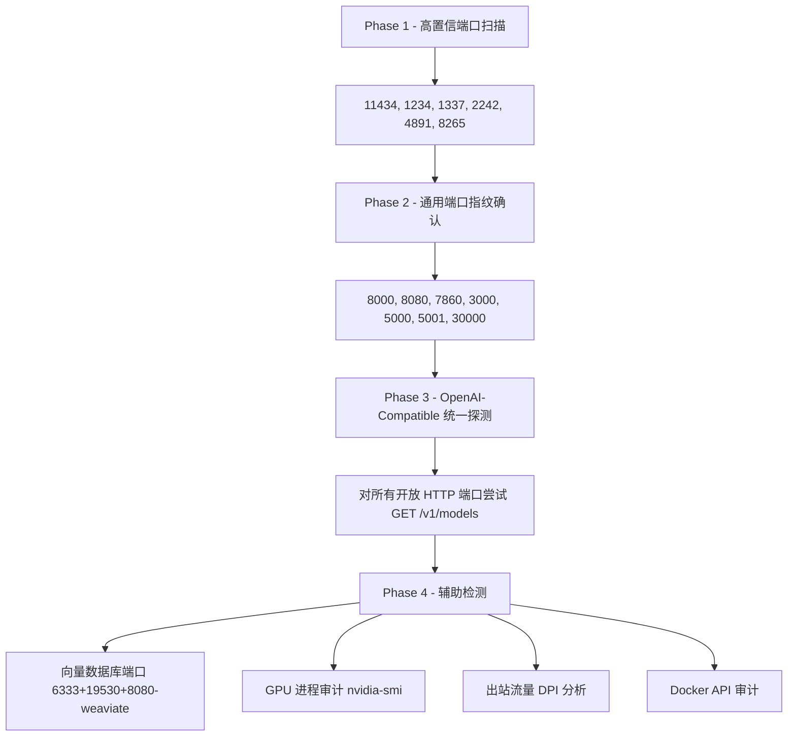

# LLM 自部署服务指纹库 - 企业影子算力检测方案

## 文档定位
本文档为企业安全团队提供的 **LLM 自部署服务网络指纹识别参考**，用途为内网资产发现扫描中识别未经审批的大模型推理服务（影子算力）。适用于安全运营中心（SOC）、资产测绘平台、NIDS/NIPS 规则编写等场景。

---

## 一、平台工具类

| 工具 | 默认端口 | 探测路径 | 高置信度特征（High） | 中低置信度辅助特征 | 典型场景 |
|------|----------|----------|---------------------|-------------------|----------|
| **Ollama** | 11434 | `/` `/api/tags` `/api/version` `/api/ps` | 根路径返回纯文本 `Ollama is running` `/api/tags` 返回 JSON 含 `"models"` 数组 `/api/version` 返回 `{"version":"x.x.x"}` | 无 Server header 端口 11434 本身即为强特征 `/api/ps` 返回运行中模型列表 | 个人开发者、团队内部快速部署 |
| **vLLM** | 8000 | `/health` `/version` `/v1/models` `/metrics` | `/version` 返回 JSON 含 `"version"` 字段值以 `vllm` 相关标识 `/metrics` 含 Prometheus 指标如 `vllm:num_requests_running` `/health` 返回 200 空体 | OpenAI-compatible `/v1/models` 响应 模型名通常为 HF 路径格式如 `meta-llama/...` | 团队、企业 GPU 推理服务 |
| **Text Generation WebUI (oobabooga)** | 7860 (UI) 5000 (API) 5005 (streaming) | `/` `/api/v1/model` `/api/v1/chat/completions` `/info` | Gradio UI HTML 含 `text-generation-webui` `/api/v1/model` 返回 `{"model_name":"..."}` 页面 title 含 `oobabooga` 或 `Text generation` | Gradio 框架特征：`__app` 相关 JS 5000 端口 API 格式特殊 URL hash 含 Gradio session ID | 个人研究、模型测试 |
| **Open WebUI** | 8080 3000 (旧版) | `/` `/api/config` `/health` `/api/v1/auths/signin` | HTML title 含 `Open WebUI` `/api/config` 返回 JSON 含 `"name":"Open WebUI"` 及 `"version"` favicon 为 Open WebUI 专属图标 | 前端 JS bundle 路径含 `open-webui` cookie 名含 `token` 登录页面结构特征 | 团队共享 ChatGPT 替代品 |
| **LM Studio** | 1234 | `/v1/models` `/v1/chat/completions` `/` | `/v1/models` 返回的 `owned_by` 字段含 `lmstudio` 或模型 ID 含 `lmstudio-community` 根路径返回 `LM Studio` 相关标识 | 端口 1234 结合 OpenAI-compatible 响应 模型命名含 `.gguf` 后缀 | 个人桌面端开启 Server 模式 |
| **LocalAI** | 8080 | `/` `/readyz` `/v1/models` `/metrics` `/system` | 根路径 HTML 含 `LocalAI` logo 或品牌标识 `/readyz` 返回健康状态 `/system` 返回含 `"build"` 信息带 `localai` | Prometheus metrics 含 `localai_` 前缀指标 `/models/available` 返回可下载模型列表 | 个人、小团队多模型管理 |
| **FastChat** | 7860 (UI) 8000 (API) 21001 (Controller) | `/v1/models` `/worker_get_status` `/` | Gradio UI title 含 `FastChat` 或 `Chatbot Arena` 21001 端口的 Controller API `/v1/models` 返回含 `fastchat` 相关标识 | 多 worker 架构下 21002+ 端口 API 响应含 `vicuna` 等默认模型名 | 团队、学术研究 |

---

## 二、原生/裸部署类

| 工具 | 默认端口 | 探测路径 | 高置信度特征（High） | 中低置信度辅助特征 | 典型场景 |
|------|----------|----------|---------------------|-------------------|----------|
| **HuggingFace TGI** | 8080 80 | `/health` `/info` `/generate` `/v1/models` `/metrics` | `/info` 返回 JSON 含 `"model_id"`, `"model_dtype"`, `"max_batch_total_tokens"`, `"docker_label"` 等字段 `/health` 返回 200 `/metrics` 含 `tgi_` 前缀 Prometheus 指标 | 响应头含 `x-compute-type` `/generate` 接受 `inputs` + `parameters` 格式 错误信息含 `text-generation-inference` | 企业级生产推理 |
| **llama.cpp server** | 8080 | `/` `/health` `/props` `/completion` `/v1/models` `/slots` | `/health` 返回 `{"status":"ok"}` 或 `{"status":"no slot available"}` `/props` 返回含 `"default_generation_settings"` 及 `"total_slots"` 字段 根路径 HTML 含 `llama.cpp` | `/slots` 返回槽位详细信息 `/completion` 接受 `prompt` 字段 Server header 可能缺失 | 个人、嵌入式、边缘推理 |
| **SGLang** | 30000 | `/health` `/get_model_info` `/v1/models` `/generate` `/health_generate` | `/get_model_info` 返回含 `"model_path"` 字段 `/health_generate` 为 SGLang 独有端点 端口 30000 结合 OpenAI-compatible API | `/v1/models` 响应中 `id` 为 HF 模型路径 `/metrics` 含 `sglang_` 前缀 | 高性能企业推理 |
| **TensorRT-LLM (Triton)** | 8000 (HTTP) 8001 (gRPC) 8002 (Metrics) | `/v2/health/ready` `/v2/health/live` `/v2/models` `/metrics` | `/v2/health/ready` 返回 200 响应头含 `Inference-Header-Content-Length` `/v2/models` 返回 Triton 模型仓库格式含 `"platform"` 字段 | Triton 特有 gRPC on 8001 `/metrics` 含 `nv_inference_` 前缀 模型名含 `tensorrt_llm` 或 `ensemble` | 企业 NVIDIA GPU 集群 |
| **Aphrodite Engine** | 2242 | `/v1/models` `/health` `/v1/info` | 端口 2242 为默认强特征 API 响应 header 或 body 含 `aphrodite` `/v1/info` 返回引擎信息 | OpenAI-compatible 格式 模型名通常为 HF 格式 支持 kobold 兼容端点 `/api/v1/info` | 个人、角色扮演社区 |
| **HF Transformers (自写 Flask/FastAPI)** | 5000 8000 随机 | `/predict` `/generate` `/v1/completions` `/` | 无统一特征 — 需组合判断：响应含 `transformers` 错误堆栈 模型名含 HF 格式路径 CUDA OOM 错误消息特征 | Flask/FastAPI 默认 Server header 响应时间长（首次加载） 无标准健康检查端点 | 研发人员 PoC、实验 |

---

## 三、RAG 及全栈平台类

| 工具 | 默认端口 | 探测路径 | 高置信度特征（High） | 中低置信度辅助特征 | 典型场景 |
|------|----------|----------|---------------------|-------------------|----------|
| **AnythingLLM** | 3001 | `/` `/api/ping` `/api/system` `/api/workspace` | 根路径 HTML 含 `AnythingLLM` `/api/ping` 返回连通性确认 favicon 及前端资源含 `anythingllm` | 前端 chunk 文件含 `mintplex` (开发公司) 需要 API key 的端点返回 `"multiUserMode"` 字段 | 小团队知识库 |
| **PrivateGPT** | 8001 | `/health` `/v1/completions` `/v1/chunks` `/v1/ingest` | `/health` 返回 `{"status":"ok"}` `/v1/ingest` 为 PrivateGPT 独有端点 `/v1/chunks` 搜索端点存在 | 基于 FastAPI 的 docs 端点 `/docs` Swagger 描述含 `PrivateGPT` | 企业隐私文档问答 |
| **Dify** | 80/443 (Nginx) 5001 (API) | `/` `/apps` `/console/api/setup` `/api/v1` | HTML title 含 `Dify` `/console/api/setup` 返回初始化状态 前端 JS 含 `dify` 命名空间 | Cookie 含 `dify_` 前缀 多容器部署含 Redis/Weaviate 等 `/api/v1/parameters` 存在 | 企业 AI 应用构建平台 |
| **Langflow** | 7860 | `/` `/api/v1/flows` `/health` `/api/v1/version` | HTML title 含 `Langflow` `/api/v1/version` 返回含 `langflow` 版本 前端为 React 应用含 `langflow` 资源 | 基于 FastAPI `/docs` 端点 流式编辑器 UI 特征 WebSocket 连接 | 团队 LLM 工作流编排 |
| **Flowise** | 3000 | `/` `/api/v1/chatflows` `/api/v1/nodes` `/api/v1/ping` | HTML 含 `Flowise` `/api/v1/ping` 返回确认 前端 JS bundle 含 `flowise` | 可视化节点编辑器 UI API 返回含 `chatflowId` 字段 嵌入 widget 脚本含 `flowise` | 低代码 AI 应用 |
| **h2oGPT** | 7860 | `/` `/api/v1` `/info` | Gradio UI title 含 `h2oGPT` 页面含 `h2o.ai` 品牌标识 Gradio API 端点含 h2oGPT 特有参数 | Gradio 框架通用特征 模型名含 `h2oai/` 前缀 | 企业文档问答 |

---

## 四、其他常见部署方式

| 工具 | 默认端口 | 探测路径 | 高置信度特征（High） | 中低置信度辅助特征 | 典型场景 |
|------|----------|----------|---------------------|-------------------|----------|
| **Jan.ai** | 1337 | `/v1/models` `/v1/chat/completions` `/health` | 端口 1337 结合 OpenAI-compatible API `/v1/models` 返回模型 ID 含 Jan 模型命名格式（如 `trinity-`, `tinyllama` 等 Jan 社区模型） Server 响应含 `cortex` (Jan 底层引擎) | 桌面端 Electron 进程特征 模型文件路径含 `jan/models` 本地 API 仅监听 127.0.0.1（默认） | 个人桌面使用 |
| **GPT4All** | 4891 | `/v1/models` `/v1/completions` `/v1/chat/completions` | 端口 4891 为默认强特征 `/v1/models` 返回 `.gguf` 模型名 模型 `owned_by` 含 `gpt4all` | Electron 桌面进程 模型命名含 `gpt4all-` 前缀 仅本地绑定（需配置才暴露） | 个人离线使用 |
| **BentoML** | 3000 | `/` `/healthz` `/readyz` `/metrics` `/docs` | 响应头 `Server: BentoML` 或 `X-BentoML-Version` `/healthz` 返回 200 `/docs` 显示 Swagger 含 BentoML 生成的 schema | Prometheus metrics 含 `bentoml_` 前缀 gRPC 端口 3001 Runner 架构相关端点 | 企业 ML 服务化 |
| **Ray Serve** | 8000 (Serve) 8265 (Dashboard) | `/` `/-/routes` `/-/healthz` `/api/serve/deployments` (Dashboard) | 8265 Dashboard HTML 含 `Ray Dashboard` `/-/routes` 返回 Ray Serve 路由表 响应头含 `ray-serve-` 前缀 header | Dashboard API `/api/cluster_status` 多节点 GCS 端口 6379 Worker 端口范围 10000+ | 企业分布式推理集群 |
| **KoboldCpp** | 5001 | `/api/v1/info` `/api/v1/model` `/api/v1/generate` `/` | `/api/v1/info` 返回含 `"koboldcpp"` 标识及版本 根路径 HTML UI 含 `KoboldAI` 品牌 同时提供 Kobold + OpenAI 兼容端点 | `/api/extra/version` 存在 GGUF/GGML 模型格式 端口 5001 | 个人创意写作、角色扮演 |
| **TabbyAPI** | 5000 | `/v1/models` `/v1/model` `/health` `/v1/auth` | `/v1/model` (单数)为 TabbyAPI 独有端点 响应含 `TabbyAPI` 标识 支持 EXL2 量化格式相关参数 | 基于 FastAPI 需 admin key 验证 模型名含 exl2 后缀 | 个人高性能量化推理 |
| **Kubernetes 上的 LLM 服务** | 多样 | Ingress 路径 NodePort 30000-32767 `/healthz` `/readyz` | K8s 特有 Ingress header 如 `x-request-id` istio/envoy sidecar header 如 `x-envoy-upstream-service-time` Service mesh 特征 | NodePort 范围内发现上述任一 LLM 特征 TLS 证书含内部 CA 多副本负载均衡特征 | 企业平台化部署 |

---

## 五、通用 OpenAI-Compatible 服务统一探测方法

| 探测维度 | 方法 | 判定逻辑 |
|----------|------|----------|
| **标准端点存在性** | `GET /v1/models` | 返回 200 且 body 为 JSON 含 `"object":"list"` + `"data"` 数组 |
| **Chat 端点** | `POST /v1/chat/completions` (空 body 或最小请求) | 返回 4xx 错误但错误格式为 OpenAI JSON 格式含 `"error"` 对象 |
| **Embeddings 端点** | `GET /v1/embeddings` 或 `POST` 空 body | 端点存在即说明为 LLM 推理服务 |
| **模型名称分析** | 解析 `/v1/models` 返回的模型列表 | 模型名含 HF 路径、GGUF、AWQ、GPTQ、EXL2 等量化关键词即确认为本地部署 |
| **响应头分析** | 检查所有非标准响应头 | `x-inference-time`、`x-request-id`（非 CDN）、`x-compute-type` 等 |
| **错误信息指纹** | 发送畸形请求触发错误 | Python traceback 含 `transformers`/`torch`/`vllm`/`sglang` 等库名 |
| **延迟特征** | 首次请求 vs 后续请求的 TTFT | 冷启动延迟极长（模型加载）为本地部署强特征 |

---

## 六、RAG 系统常见识别特征

| 特征类别 | 具体表现 |
|----------|----------|
| **专属 API 端点** | `/v1/ingest`、`/v1/chunks`、`/upload`、`/api/workspace/*/chat`、`/api/v1/documents` |
| **向量数据库暴露** | ChromaDB (8000)、Weaviate (8080, 路径 `/v1/schema`)、Milvus (19530)、Qdrant (6333, 路径 `/collections`)、Pinecone 代理 |
| **文件上传功能** | Multipart 上传端点、支持 PDF/DOCX/TXT 格式解析 |
| **组合部署特征** | 同一主机或网段内同时存在：LLM 端口 + 向量数据库端口 + 文件处理端口 |
| **前端 UI 特征** | 含文件拖拽区域、知识库管理面板、文档列表视图 |
| **检索增强响应格式** | API 响应含 `"sources"`、`"context"`、`"references"`、`"chunks"` 等额外字段 |

---

## 七、最容易被遗漏的隐蔽部署方式

| 隐蔽方式 | 描述 | 检测建议 |
|----------|------|----------|
| **仅绑定 localhost 的桌面工具通过 SSH 隧道/反向代理暴露** | Jan、LM Studio、GPT4All 默认仅监听 127.0.0.1，用户通过 SSH -R 或 Cloudflare Tunnel 对外暴露 | 监控出站持久隧道连接、Cloudflare Argo Tunnel 进程、ngrok 等 |
| **Jupyter Notebook 内嵌推理** | 在 JupyterHub 内直接加载模型运行推理，无独立端口 | 检测 GPU 使用异常、Jupyter 进程内存占用、`nvidia-smi` 进程列表 |
| **VS Code Server 插件 (Continue, Copilot 替代)** | 通过 VS Code Remote 插件调用本地模型，端口随机绑定 | 进程检测含 `ollama`、`llama-server` 子进程、GPU 占用 |
| **Docker 容器随机端口映射** | `docker run -p 0:8080` 使用随机高端口 | 全端口段扫描、Docker socket API 审计 (`/containers/json`) |
| **WebSocket-only 服务** | 某些部署仅通过 WebSocket 提供推理，无 REST 端点 | WebSocket 握手探测 `Upgrade: websocket`，检查 `ws://host:port` |
| **嵌入现有 Web 应用** | 将 LLM 推理嵌入已有业务系统的某个路径下（如 `/internal/ai/chat`） | 对已知 Web 应用进行路径字典爆破，关注新增 `/ai`、`/llm`、`/chat` 路径 |
| **Serverless GPU (RunPod, Vast.ai) 远程调用** | 模型部署在外部 GPU 云，通过 API Key 从内网调用 | 出站流量分析：目标为 `api.runpod.ai`、`vast.ai`、`modal.com` 等 |
| **WASM-based 浏览器推理 (WebLLM)** | 完全在浏览器端运行，无服务端端口 | 无法通过网络扫描检测，需终端 EDR 检测 GPU/WebGPU 调用 |
| **模型文件挂载 NFS/SMB 共享** | 模型权重文件存储在共享存储上，多人挂载使用 | 监控大文件（5GB+）存取于共享存储的异常模式 |
| **Ollama 修改端口部署** | 修改 `OLLAMA_HOST` 环境变量绑定到非标准端口 | 结合进程名检测 + 全端口 `/api/tags` 路径指纹探测 |

---

## 八、端口速查汇总表

| 端口 | 关联服务 | 置信度说明 |
|------|----------|-----------|
| 1234 | LM Studio | 高 - 几乎唯一使用此端口的 LLM 服务 |
| 1337 | Jan.ai (Cortex) | 高 |
| 2242 | Aphrodite Engine | 高 - 默认且少见 |
| 3000 | Flowise, BentoML, Open WebUI (旧) | 中 - 需二次确认 |
| 3001 | AnythingLLM | 中高 |
| 4891 | GPT4All | 高 |
| 5000 | oobabooga API, TabbyAPI, Flask 裸部署 | 中 - 通用端口需二次确认 |
| 5001 | KoboldCpp, Dify API | 中 |
| 6333 | Qdrant 向量数据库 | 辅助-RAG 组件 |
| 7860 | Gradio 系 (oobabooga, h2oGPT, FastChat, Langflow) | 中 - Gradio 通用端口 |
| 8000 | vLLM, TensorRT-LLM Triton, Ray Serve, FastChat API | 中低 - 过于通用 |
| 8080 | TGI, llama.cpp, LocalAI, Open WebUI, Weaviate | 中低 - 需特征二次确认 |
| 8001 | PrivateGPT, Triton gRPC | 中 |
| 8265 | Ray Dashboard | 高 |
| 11434 | Ollama | 高 - 唯一使用此端口 |
| 30000 | SGLang | 中高 |
| 19530 | Milvus 向量数据库 | 辅助-RAG 组件 |

---

## 九、推荐扫描策略优先级

---

## 十、备注

1. **Jan.ai 特别说明**：根据其官网信息，Jan 定位为桌面端个人 AI 助手（5.5M+ 下载量），支持离线运行开源模型及在线模型（OpenAI/Claude/Gemini 等）。其底层引擎 Cortex 默认在 1337 端口提供 API。由于 Jan 主打"Personal Intelligence"，在企业环境中属于高频出现的个人私装软件，应重点关注 Electron 进程及 1337 端口。
2. **版本迭代注意**：文中特征基于 2025 年中各工具主流版本，部分工具（如 Open WebUI 从 Ollama WebUI 更名、vLLM 版本快速迭代）可能调整默认行为，建议每季度更新指纹库。
3. **合规使用建议**：本指纹库仅用于企业合规审计，扫描前需获得授权，避免触发安全告警或影响正常业务。